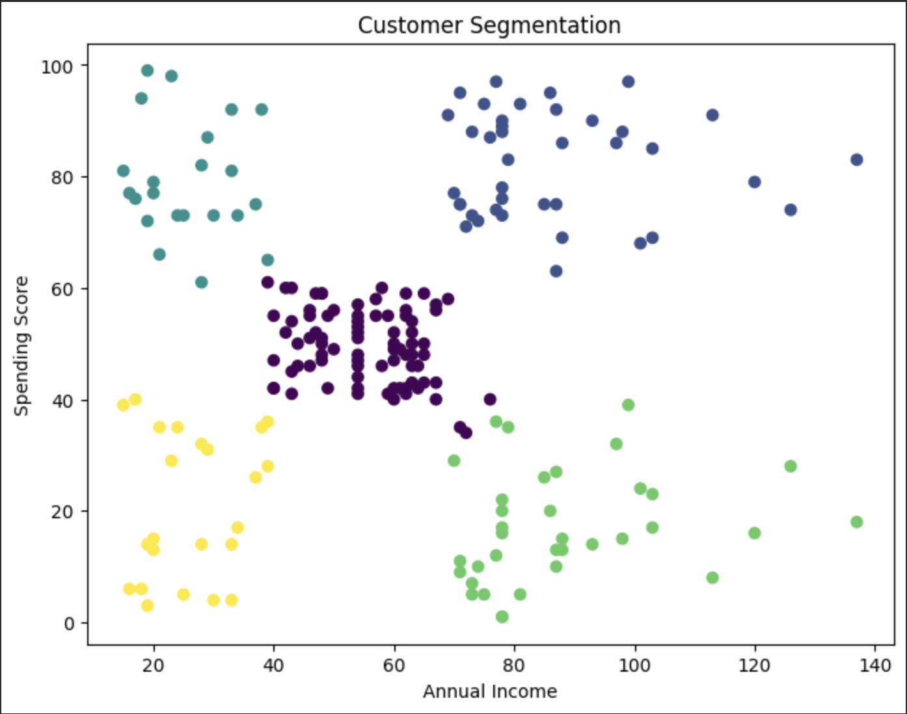

# Customer Segmentation Analysis

## Project Overview

This project focuses on customer segmentation using Machine Learning techniques to identify distinct groups of customers based on their purchasing behavior and annual income. The objective is to help businesses better understand customer preferences and design targeted marketing strategies.

## Dataset

The dataset contains the following attributes:

- Customer ID
- Gender
- Age
- Annual Income (k$)
- Spending Score (1–100)

## Objectives

- Analyze customer purchasing behavior.
- Identify meaningful customer segments.
- Apply clustering techniques for segmentation.
- Visualize customer groups and their characteristics.
- Generate business insights for targeted marketing.

## Tools and Technologies

- Python
- Google Colab
- Pandas
- NumPy
- Scikit-learn
- Matplotlib

## Methodology

### 1. Data Loading and Exploration

The dataset was loaded and explored to understand customer demographics and spending behavior.

### 2. Feature Selection

The following features were selected for clustering:

- Annual Income (k$)
- Spending Score (1–100)

### 3. Elbow Method

The Elbow Method was used to determine the optimal number of clusters for customer segmentation.

### 4. K-Means Clustering

K-Means Clustering was applied to group customers based on income and spending patterns.

### 5. Visualization

Customer segments were visualized using scatter plots to identify distinct customer groups.

## Customer Segmentation Visualization

## Results

The analysis identified the following customer segments:

- High Income – High Spending Customers
- High Income – Low Spending Customers
- Low Income – High Spending Customers
- Low Income – Low Spending Customers
- Average Income – Average Spending Customers

## Business Insights

- Premium customers can be targeted through loyalty programs.
- High-income customers with low spending can be encouraged through personalized offers.
- Highly engaged customers can be retained through reward programs.
- Customer segmentation helps improve marketing efficiency and customer retention.

## Project Outcome

This project demonstrates the practical application of Machine Learning for customer analytics and customer segmentation using K-Means Clustering.

## Author

**Shourya Rajpoot**
